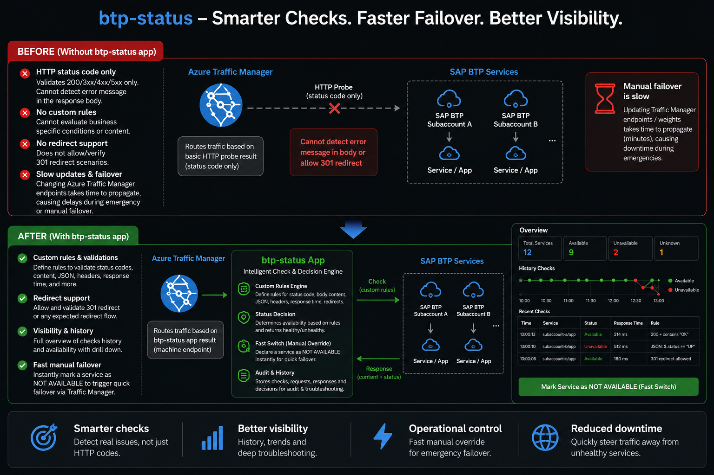
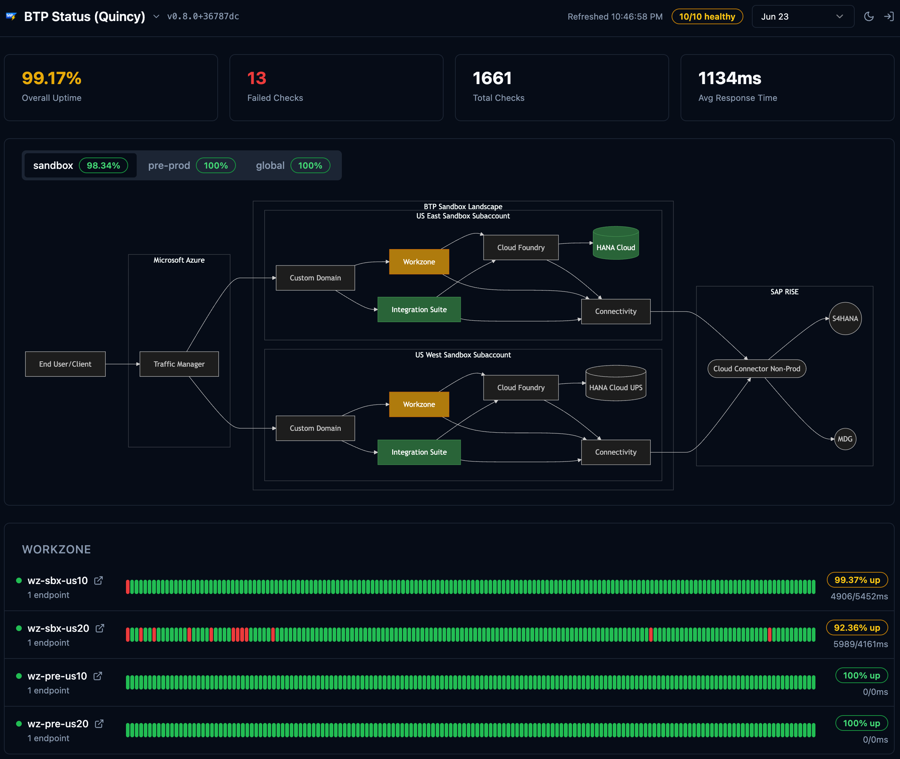
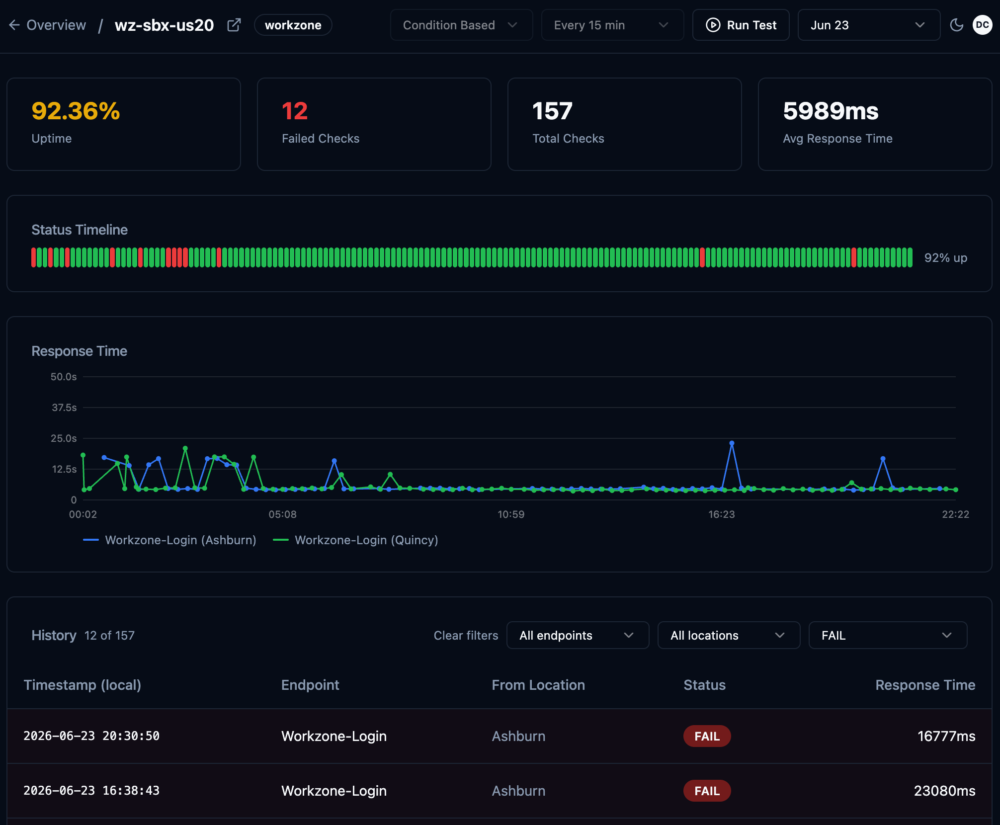
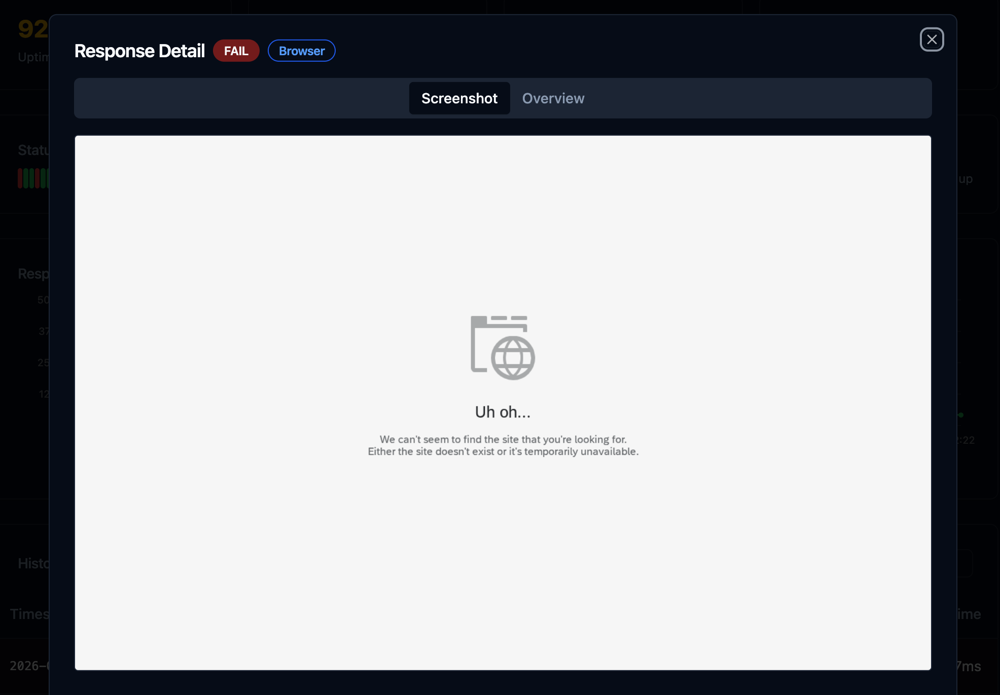

# BTP Status

A lightweight, file-backed status page and health checker for SAP BTP services. Compatible with Azure Traffic Manager's HTTP probe mechanism and provides a Gatus-style admin dashboard for reviewing availability history.



## Screenshots

**Overview** — landscape diagram with live service status and timeline dots



**Service detail** — uptime stats, response time chart, and full check history



**Drill-down** — full request/response detail and screenshot from a past check



## Features

1. **Azure Traffic Manager probe endpoint** — `GET /health/{service}` returns `200 OK` when all conditions pass or `500` with failure details when any condition fails; designed as a drop-in health probe for Azure Traffic Manager so unhealthy BTP services are automatically taken out of rotation

2. **Browser-based IAS login check** (`mode: browser-ias-login`) — headless Chromium fills the SAP IAS login form, waits for a CSS selector to confirm the post-login page loaded, and captures a screenshot; validates the full authentication flow end-to-end, not just HTTP reachability; screenshot is stored with the check record and visible in the history drill-down and Test popup

3. **Status timeline, history, and drill-down** — color-coded dot timeline per service on the Overview page; per-service detail shows uptime %, avg response time, a response time chart per endpoint, and a full history table with filters (endpoint, location, status, date range); clicking any dot opens a modal with the complete request/response/condition result and screenshot; when XSUAA is enabled the detail endpoint requires authentication — unauthenticated users see a **Login** button in the modal and the full detail loads automatically after they log in

4. **Evaluation mode override** (`Always OK` / `Always Error`) — per-service toggle to force a service to report healthy or failing regardless of actual check results; use **Always Error** to deliberately route traffic away during a known incident or planned failover; use **Always OK** to restore a service to rotation after maintenance without waiting for checks to pass; changes take effect immediately across all execution paths (scheduled checks, `/health/:name`, Run Test)

5. **Landscape diagram with live status** — tabbed Mermaid flowchart diagrams on the Overview page showing service topology; diagram nodes are coloured by live health status and are clickable links to the service detail page; compose diagrams at [mermaid.live](https://mermaid.live/); active tab is persisted in the URL hash for easy sharing

6. **File-based storage — no database** — every check result is saved as a plain JSON file under `./response/`; no database, message broker, or external service required; XSUAA is optional and used only for authentication; the response directory is the only persistent state

7. **Two-instance sync for CF file persistence** — Cloud Foundry containers are ephemeral and lose local files on restart; point one instance at another via `SYNC_REMOTE` and each instance will download missing response files from its peer on startup and periodically thereafter, forming a resilient pair; see [Remote Sync](#remote-sync)

8. **Minimal server dependencies** — production runtime requires only Express (HTTP), Pino (logging), and Playwright (browser checks); all HTTP requests, crypto, gzip compression, and ZIP packaging use native Node.js APIs — no axios, no ORM, no utility libraries

9. **Modern, fast React UI** — built with shadcn/ui + Tailwind CSS; initial JS bundle ~55 kB gzip (lazy-loaded pages, Mermaid deferred); dark theme; mobile-responsive with hamburger menu; shared date range picker with localStorage persistence across pages

> Also supports: HTTP health checks with [Gatus](https://github.com/TwiN/gatus#conditions)-style conditions (`[STATUS]`, `[BODY]`, `[HEADER.*]`, `[RESPONSE_TIME]`, `len()`, `pat()`); variable substitution in `config.json`; `/dummy` URL to skip checks; auto-run schedule selector; site switcher for multi-region deployments; SAP BTP Cloud Foundry MTA deployment

## Quick Start

### Prerequisites

- Node.js 20+
- npm 9+

### Development

```bash
# 1. Install dependencies
npm install

# 2. Copy sample config and fill in real values
cp server/config-sample.json server/config.json
# Edit server/config.json with your real service endpoints and credentials

# 3. Build client once, then start Express (serves UI + API on :3000)
npm run dev
```

Open http://localhost:3000/overview

When iterating on the frontend, rebuild the client in a second terminal while the server keeps running:

```bash
# Terminal 1 — Express with auto-restart on server file changes
npm run dev:server

# Terminal 2 — Vite rebuild on every client file change
npm run watch:client
```

### Production Build

```bash
npm run build   # builds React → server/public/, then compiles server TypeScript
npm start       # runs Express on PORT (default 3000)
```

Open http://localhost:3000/overview

## Configuration

The server resolves configuration in this priority order:

1. **`CONFIG_JSON` env var** — JSON string with the full config (useful for BTP env properties, no file needed)
2. **`CONFIG_FILE` env var / default** — path to a JSON file (default: `./config.json` relative to the `server/` working directory, i.e. `server/config.json` from the repo root)

Create `server/config.json` (copy `server/config-sample.json` and fill in real values):

```json
{
  "variables": {
    "MONITOR_USERNAME": "monitor@example.com",
    "MONITOR_PASSWORD": "your-monitor-password",
    "SYNC_KEY": "your-secret-sync-key"
  },
  "landscapes": [
    {
      "name": "production",
      "diagram": "flowchart LR\n    User --> my-service"
    }
  ],
  "services": [
    {
      "group": "WorkZone",
      "name": "my-service",
      "enabled": true,
      "landscapes": ["production"],
      "interval": 900,
      "endpoints": [
        {
          "name": "Health Check",
          "url": "https://my-service.example.com/health",
          "method": "GET",
          "conditions": [
            "[STATUS] == 200",
            "[RESPONSE_TIME] < 3000"
          ]
        },
        {
          "mode": "browser-ias-login",
          "name": "Login Check",
          "url": "https://my-service.example.com/login",
          "username": "{{MONITOR_USERNAME}}",
          "password": "{{MONITOR_PASSWORD}}",
          "waitForSelector": "#app-title",
          "timeout": 30000
        }
      ]
    }
  ]
}
```

### Config Fields

**Top-level**

| Field | Type | Description |
|-------|------|-------------|
| `variables` | object | Key→value map; `{{key}}` placeholders in endpoint fields are substituted at startup |
| `landscapes` | array | List of landscape definitions for the Overview diagram tabs |
| `landscapes[].name` | string | Landscape identifier (shown as tab label) |
| `landscapes[].diagram` | string | Mermaid diagram source; nodes whose ID matches a service `name` are coloured by status |
| `sites` | array | List of deployed instances for the site-switcher dropdown (optional; dropdown hidden when fewer than 2 entries) |
| `sites[].name` | string | Display name for the site (e.g. `"Ashburn"`, `"Frankfurt"`) |
| `sites[].url` | string | Base URL of that deployed instance (e.g. `"https://btp-status-ashburn.cfapps.us10.hana.ondemand.com"`); the current site is matched by comparing the browser's `window.location.origin` against the configured URL's origin |
| `services` | array | List of service configs |

- Tip: compose landscape diagrams at [mermaid.live](https://mermaid.live/)

**Per service**

| Field | Type | Description |
|-------|------|-------------|
| `group` | string | Group name for dashboard grouping |
| `name` | string | Unique service identifier (used in URLs and diagram node matching) |
| `enabled` | boolean | Set `false` to exclude from checks |
| `interval` | number | Auto-check interval in seconds; `0` or omitted disables automatic checks |
| `homepage` | string | Optional homepage URL shown as ↗ link on the dashboard |
| `landscapes` | string[] | Landscape names this service belongs to (for tab filtering and availability badge) |
| `endpoints[].name` | string | Display name for this endpoint |
| `endpoints[].url` | string | URL to probe; set to `/dummy` to skip the check and always record `200 OK` |
| `endpoints[].method` | string | HTTP method (`GET`, `POST`, etc.) |
| `endpoints[].headers` | object | Request headers; `{{variable}}` placeholders are substituted |
| `endpoints[].body` | string\|null | Request body; `{{variable}}` placeholders are substituted |
| `endpoints[].conditions` | string[] | Conditions to validate (Gatus syntax) |
| `endpoints[].mode` | string | `browser-ias-login` to use headless Chromium instead of an HTTP request |
| `endpoints[].username` | string | IAS username; `{{variable}}` substitution supported |
| `endpoints[].password` | string | IAS password; `{{variable}}` substitution supported |
| `endpoints[].waitForSelector` | string | CSS selector to wait for after login (browser-ias-login only) |
| `endpoints[].timeout` | number | Request timeout in ms. For standard HTTP checks, overrides `REQUEST_TIMEOUT_MS` for this endpoint; a timed-out check is recorded as `504`. For `browser-ias-login` mode, sets the overall browser session timeout (default `30000`). |

### Condition Syntax

Conditions follow [Gatus](https://github.com/TwiN/gatus#conditions) syntax:

| Condition | Description | Example |
|-----------|-------------|---------|
| `[STATUS] == 200` | HTTP status code | `[STATUS] == 301` |
| `[RESPONSE_TIME] < 500` | Response time in ms | `[RESPONSE_TIME] < 2000` |
| `[BODY] == "text"` | Body equals string | `[BODY] == "OK"` |
| `[BODY].key == "value"` | JSON body field (dot-path) | `[BODY].status == "healthy"` |
| `[HEADER.name] == "value"` | Response header value | `[HEADER.content-type] == "application/json"` |
| `len([BODY].arr) > 0` | Array/object length | `len([BODY].items) > 0` |
| `[BODY] == pat(*glob*)` | Glob/regex pattern match | `[BODY] == pat(*authentication*)` |

Operators: `==`, `!=`, `<`, `>`, `<=`, `>=`

### Browser-based IAS Login Check

Set `mode: "browser-ias-login"` on an endpoint to use a headless Chromium session instead of a plain HTTP request:

```json
{
  "mode": "browser-ias-login",
  "name": "Workzone Login",
  "url": "https://<tenant>.launchpad.cfapps.<region>.hana.ondemand.com/site/<site>?sap_idp=<idp>",
  "username": "monitor@example.com",
  "password": "secret",
  "waitForSelector": "#shellAppTitle",
  "timeout": 30000
}
```

The check flow:
1. Launch headless Chromium, navigate to `url` (which triggers the IAS redirect)
2. Fill `#j_username`, click `#next-button`
3. Fill `#j_password`, click `#logOnFormSubmit`
4. Wait for the CSS selector `waitForSelector` to appear in the DOM — success if found before `timeout`, failure otherwise
5. Capture a screenshot and collect all browser console messages regardless of outcome
6. Dump the current page HTML source
7. Save three sidecar files alongside the JSON record:
   - `…_{status}.png` — screenshot
   - `…_{status}_console.log` — timestamped browser console output (log, error, warning, etc.)
   - `…_{status}_content.html` — raw HTML source of the page at check completion

The **Response Detail** modal shows four tabs for browser checks (tabs appear only when the corresponding file exists):

| Tab | Content |
|-----|---------|
| **Overview** | Check metadata, result message, conditions table (default) |
| **Screenshot** | Full-page screenshot |
| **Console** | Timestamped browser console messages (useful for JS errors and blank-screen failures) |
| **Page Source** | Raw HTML of the page (useful for inspecting what was rendered during a failed login) |

All three sidecar files are included in remote sync and pruned by the housekeeping scheduler alongside their JSON counterpart.

> **Chromium setup (local dev)**: run `npx playwright install chromium` once after `npm install`.  
> On SAP BTP Cloud Foundry, Google Chrome is installed automatically via the apt-buildpack — no manual step required (see [BTP deployment notes](#deployment-sap-btp-mta)).

### Automatic Checks

When `interval` is set to a value greater than `0`, the server automatically runs a health check for that service every `interval` seconds — no external scheduler or cron job required.

- If a check is already running when the next interval fires, that tick is **skipped** (no pile-up).
- Errors inside a check are caught and logged; the timer continues unaffected.
- All timers are released with `unref()` so they do not block graceful process shutdown.
- On `SIGTERM` / `SIGINT` the scheduler stops cleanly before the HTTP server closes.

## API Endpoints

| Endpoint | Description |
|----------|-------------|
| `GET /health/:name` | Run health check; returns `200 OK` or `500 <failure details>` (Azure Traffic Manager) |
| `GET /overview` | Overview dashboard UI |
| `GET /service/:name` | Service detail UI — history timeline, drill-down, "Run Test" button |
| `GET /api/services` | List all services (JSON) |
| `GET /api/check/:name` | Run health check, return structured JSON with per-endpoint request/response/conditions (used by Test popup) |
| `GET /api/overview?hours=24` | Overview data for all services (JSON); also accepts `?from=YYYY-MM-DD&until=YYYY-MM-DD` for date range queries |
| `GET /api/history/:name?hours=24` | History file list for a service (JSON); also accepts `?from=YYYY-MM-DD&until=YYYY-MM-DD` for date range queries |
| `GET /api/history/:name/:filename` | Full request/response detail for one check (JSON) |
| `GET /api/info` | Server capabilities: `{ syncRemote, city, sites, maxStorageDays }` |
| `GET /api/eval-mode/:name` | Current evaluation mode: `{ mode: "condition" \| "alwaysok" \| "alwayserror" }` |
| `POST /api/eval-mode/:name` | Set evaluation mode (JSON body `{ "mode": "..." }`); resets to `condition` on server restart |
| `GET /api/schedule/:name` | Current effective interval in seconds: `{ intervalSeconds }` |
| `POST /api/schedule/:name` | Set schedule override (JSON body `{ "intervalSeconds": N }`); `0` disables autorun; resets on server restart |
| `POST /api/sync` | Trigger an on-demand remote sync; returns `{ ok, files, transferredMB, decompressedMB, elapsedSec }` or `{ ok: false, busy: true }` if a sync is already running |
| `GET /api/browse` | List all response files grouped by service folder: `{ folders: { name: [filename, ...] } }` |
| `GET /api/download?path=folder/file.json` | Download a single response file (path restricted to `response/` directory) |

### Evaluation Mode & Schedule

On any service's detail page (`/service/:name`), two selectors in the header control the service without restarting the server:

**Evaluation Mode** — how check results are interpreted:

| Mode | `/health/:name` | Saved status | Timeline dot |
|------|----------------|-------------|--------------|
| **Condition Based** (green, default) | `200`/`500` based on actual conditions | `200` or `500` | Green / Red |
| **Always OK** (dark green) | Always `200 OK` regardless of conditions | `203` | Dark green |
| **Always Error** (dark red) | Always `500` regardless of conditions | `503` | Dark red |

A confirmation dialog appears before applying Always OK or Always Error. Both modes honour the evaluation setting for all execution paths (scheduled checks, manual `/health/:name`, Run Test).

**Schedule** — auto-run interval:

| Option | Effect |
|--------|--------|
| Every 5 / 10 / 15 / 30 min / 1 hour | Reschedules the service immediately; overrides `config.json` interval |
| Disable autorun | Stops scheduled checks; only manual `/health/:name` or Run Test will record results |

All overrides are in-memory and reset to their `config.json` defaults on server restart.

### Azure Traffic Manager

Point your Traffic Manager HTTP probe at:

```
GET https://<your-app>/health/<service-name>
```

- Returns `200 OK` (plain text) → endpoint is healthy
- Returns `500` (plain text with failure details) → endpoint is unhealthy

## Authentication and Authorization

By default the app runs without authentication — all endpoints and admin controls are publicly accessible. When a **XSUAA** service binding is present (`VCAP_SERVICES` contains an `xsuaa` entry), the app switches into authenticated mode automatically.

### How It Works

Authentication follows the **OAuth2 Authorization Code flow** via a browser popup — no `@sap/approuter` dependency. Everything is implemented with `node:crypto` and the Node.js standard library.

1. The user clicks the person icon (top-right of any page).
2. A popup opens `/login`, which immediately redirects to the XSUAA authorize URL.
3. After the user authenticates, XSUAA redirects to `/login/callback?code=…`.
4. The server exchanges the code for a JWT, verifies the RS256 signature against the `verificationkey` from the XSUAA binding, and extracts `firstName`, `isAdmin`, `sub`, and `exp`.
5. A signed session cookie (`btpauth`) is set: `base64url(JSON payload) + "." + HMAC-SHA256(payload, clientSecret)`.
6. The popup posts `{ type: "login", user: { firstName, isAdmin } }` back to the main window via `window.opener.postMessage` and closes itself — no page reload required.

Logout follows the same popup pattern: the server clears the cookie and posts `{ type: "logout" }`.

### Session Cookie

| Property | Value |
|----------|-------|
| Name | `btpauth` |
| Signing | HMAC-SHA256 (key = XSUAA `clientsecret`); verified on every protected request using `timingSafeEqual` |
| HttpOnly | Yes — not accessible from JavaScript |
| Secure | Yes when running on BTP (`VCAP_APPLICATION` is present); omitted for local HTTP dev |
| SameSite | Lax |
| Max-Age | Derived from the JWT `exp` claim |

### Admin Role

The **BTP Status Admin** role collection grants write access to evaluation mode and schedule overrides. It is created automatically on first deploy (defined in `xs-security.json` via `role-collections`). To activate it:

1. In BTP Cockpit → Security → Role Collections, find **BTP Status Admin** (auto-created by the deployment).
2. Assign it to the relevant users or user groups.

### Protected Routes

| Route | Guard | Description |
|-------|-------|-------------|
| `GET /api/check/:name` | Auth required | Run health check (used by Test All / Run Test) |
| `POST /api/sync` | Auth required | Trigger on-demand remote sync |
| `POST /api/eval-mode/:name` | Admin required | Change evaluation mode |
| `POST /api/schedule/:name` | Admin required | Change schedule override |

All other routes (read-only data, static assets) are public regardless of auth state.

### UI Behaviour

| Auth State | Test All / Sync / Run Test | Eval Mode / Schedule selectors |
|-----------|---------------------------|-------------------------------|
| XSUAA not configured | Visible and active | Visible and active |
| Logged out | Hidden | Hidden |
| Logged in (no admin role) | Visible and active | Visible but disabled |
| Logged in (admin role) | Visible and active | Visible and active |

### BTP Setup

Add an XSUAA resource to `mta.yaml` (already included) and `xs-security.json` (already included in the repo). On first deploy with the XSUAA resource, BTP provisions the service instance automatically.

```yaml
# mta.yaml — resources section
resources:
  - name: btp-status-xsuaa
    type: org.cloudfoundry.managed-service
    parameters:
      service: xsuaa
      service-plan: application
      path: ./xs-security.json
      config:
        xsappname: btp-status
```

After deployment, the `VCAP_SERVICES` environment variable injected by BTP will contain the XSUAA credentials, and the app will enable authentication automatically.

### Local Development (No Auth)

When `VCAP_SERVICES` is not set (local dev), all auth middleware passes through — no login is required and all controls remain fully active. This is the default for `npm run dev`.

## Response File Storage

Each health check saves a file at:

```
./response/{service-name}/yyyyMMdd-HHmmss_{endpointSlug}_{city}_{responseTimeMs}_{200|203|500|503}.json
```

- **Timestamp**: UTC (`yyyyMMdd-HHmmss`)
- **endpointSlug**: endpoint `name` from config with non-alphanumeric chars replaced by dashes
- **city**: full city name from `ip-api.com` with spaces replaced by dashes (e.g. `Frankfurt-am-Main`); resolved once at startup; `unknown` if lookup fails or times out
- **responseTimeMs**: integer milliseconds, no suffix
- **Status codes**: `200` = genuine pass, `203` = pass under Always OK, `500` = genuine fail, `503` = fail under Always Error

Old-format files (`yyyyMMdd-HHmmss_{index}_{ms}ms_{status}.json`, local-timezone timestamp) are still read and displayed correctly alongside new-format files.

File content:
```json
{
  "request": { "url": "...", "method": "GET", "headers": {}, "body": null },
  "response": { "status": 200, "headers": {}, "body": "..." },
  "timestamp": "2026-06-16T10:00:00.000Z",
  "responseTime": 342,
  "endpointIndex": 0,
  "endpointName": "Health Check",
  "conditions": [
    { "condition": "[STATUS] == 200", "passed": true, "actual": "200", "expected": "== 200" }
  ],
  "overallStatus": 200
}
```

## Logging

The server uses [pino](https://getpino.io) with colorized pretty-print output.

| Level | When |
|-------|------|
| `INFO` | Server startup · config source (file vs env var) · incoming `/health/:name` requests · pass/fail result · manual test trigger |
| `DEBUG` | Outgoing HTTP method + URL · response status, time, body preview (first 300 chars) |
| `WARN` | Each failed condition — shows actual vs expected value (yellow) |
| `ERROR` | Network/connection errors from fetch (red, full error object + stack) |

```
[10:02:31] INFO  (service=dcore-prod from=::1) Health check request received
[10:02:31] DEBUG (service=dcore-prod endpoint="Launch Redirect" method=GET url=https://…) Sending request
[10:02:32] DEBUG (service=dcore-prod endpoint="Launch Redirect" status=301 responseTime=743) Response received
[10:02:32] INFO  (service=dcore-prod) Health check passed
```

## Environment Variables

| Variable | Default | Description |
|----------|---------|-------------|
| `PORT` | `3000` | HTTP listen port (Cloud Foundry sets this automatically) |
| `CONFIG_JSON` | — | Full config as a JSON string; takes priority over `CONFIG_FILE` (ideal for BTP env properties) |
| `CONFIG_FILE` | `./config.json` | Path to config JSON file (relative to `server/` working dir; resolved as `server/config.json` from repo root) |
| `RESPONSE_DIR` | `./response` | Directory for response file storage |
| `SYNC_REMOTE` | — | Base URL of another BTP Status instance (e.g. `https://btp-status-prod.cfapps.eu10.hana.ondemand.com`). On startup, missing response files are downloaded from the remote and saved to the local `RESPONSE_DIR`. Periodic sync runs every `SYNC_INTERVAL` seconds. |
| `SYNC_INTERVAL` | `900` | Seconds between periodic remote sync runs (minimum 60). Only effective when `SYNC_REMOTE` is set. |
| `SYNC_REMOTE_BATCH_SIZE` | `100` | Number of files requested per `POST /api/batch-download` call during sync. The sync job tries the batch endpoint first; if the remote does not support it, it falls back to individual `GET /api/download` requests with concurrency 10. |
| `MAX_RESPONSE_STORAGE_DAYS` | `3` | Response files (JSON + PNG) older than this many days are automatically deleted. Housekeeping runs once on startup then every 24 hours. Set to `0` to disable. Also controls the furthest date selectable in the UI's Date Range picker. |
| `REQUEST_TIMEOUT_MS` | `30000` | Default HTTP request timeout in milliseconds for standard endpoint checks. A check that exceeds this limit is recorded with status `504` and the response filename ends in `_504.json`. Per-endpoint `timeout` in `config.json` overrides this value for that endpoint only. |
| `LOG_LEVEL` | `debug` | Pino log level: `trace`, `debug`, `info`, `warn`, `error` |

## Remote Sync

Cloud Foundry containers are ephemeral — local files are lost on restart. Remote Sync lets two BTP Status instances back each other up: each downloads missing response files from its peer on startup and on a configurable interval, so history is preserved across restarts as long as both instances are not restarted simultaneously.

> [!WARNING]
> Do not restart both instances at the same time — they will each find nothing to sync from the other and all accumulated response files will be lost.

Set `SYNC_REMOTE` to the base URL of another running BTP Status instance to seed the local response directory on startup:

```bash
SYNC_REMOTE=https://btp-status-prod.cfapps.eu10.hana.ondemand.com npm start
```

On boot the server will:
1. Call `GET /api/browse` on the remote to get its full file list
2. Compare against the local `./response/` directory
3. Download all missing files via `POST /api/batch-download` (ZIP batches of `SYNC_REMOTE_BATCH_SIZE`, default 100); falls back automatically to `GET /api/download?path=…` (concurrency 10) if the remote does not support the batch endpoint
4. Log total files, transferred MB, decompressed MB, and elapsed seconds at `INFO`

After the initial sync, the same logic runs again every `SYNC_INTERVAL` seconds (default `900` / 15 minutes) as a background job — keeping the local instance in sync with the remote over time. Files already present locally are never re-downloaded. The timer uses `unref()` so it does not prevent graceful shutdown.

### Sync Key (optional)

To prevent unauthenticated access to the `/api/download` and `/api/batch-download` endpoints, set a shared secret on both instances:

```jsonc
// config.json
{
  "variables": {
    "SYNC_KEY": "your-secret-sync-key"
  }
}
```

Or via environment variable (takes precedence over `config.json`):

```bash
SYNC_KEY=your-secret-sync-key npm start
```

When a sync key is configured:
- The download endpoints require either a matching `x-sync-key` request header **or** a valid XSUAA session cookie
- The sync client automatically includes `x-sync-key` in all download requests to the remote
- If the remote rejects the key with `401`, the entire sync is aborted immediately with an explanatory error
- Requests with neither a valid key nor a session receive `401 Unauthorized`

Both instances must use the same key. If XSUAA is configured, authenticated browser users can also access the download endpoints without a key.

## Gzip Compression

All HTTP responses — API JSON, HTML, CSS, JavaScript — are automatically gzip-compressed using native `node:zlib` when the client sends `Accept-Encoding: gzip`. Binary image types (JPEG, PNG, GIF, etc.) are passed through uncompressed. No additional dependency is required.

## Deployment (SAP BTP MTA)

### How it works

The app is packaged as an MTA archive and deployed to SAP BTP Cloud Foundry using two buildpacks in sequence:

1. **[apt-buildpack](https://github.com/cloudfoundry/apt-buildpack)** — reads `server/apt.yml` and installs the shared system libraries that Playwright's Chromium requires on the minimal `cflinuxfs4` stack (`libnss3`, `libatk1.0-0`, `libgbm1`, etc.).
2. **nodejs_buildpack** — installs production dependencies (Playwright's npm install hook downloads its self-contained Chromium binary at this point), compiles and runs the app.

This means no Docker image management is required. Playwright's bundled Chromium is downloaded during CF staging and is available when the app starts.

### Prerequisites

```bash
npm install -g mbt                  # Cloud MTA Build Tool
cf install-plugin multiapps         # CF MTA plugin (once per CF CLI install)
```

### Build & Deploy

```bash
# Log in
cf login -a https://api.cf.<region>.hana.ondemand.com
cf target -o <org> -s <space>
```

| Script | What it does |
|--------|-------------|
| `npm run bd` | Build MTA archive + standard deploy (full pipeline) |
| `npm run bd-bg` | Build MTA archive + blue-green deploy (full pipeline, zero-downtime) |
| `npm run deploy` | Standard deploy of an already-built `.mtar` (skips `mbt build`) |
| `npm run deploy-bg` | Blue-green deploy of an already-built `.mtar` (skips `mbt build`) |

```bash
# Full pipeline: build then deploy
npm run bd       # standard deploy
npm run bd-bg    # blue-green deploy (zero-downtime)

# Redeploy an existing archive without rebuilding
npm run deploy      # standard
npm run deploy-bg   # blue-green
```

**Blue-green strategy** (`--strategy blue-green --skip-testing-phase`) starts a parallel "green" instance, waits for it to be healthy, routes traffic to it, then removes the old "blue" instance — minimising downtime during deploys.

`keep-existing: env: true` in `mta.yaml` instructs the MTA deployer to **preserve existing environment variables** (e.g. `CONFIG_JSON`, `SYNC_REMOTE`) on the app during deployment, so runtime config set via `cf set-env` is not wiped by a redeploy.

### Post-deploy config

Two options for providing the service config on BTP:

**Option A — include the file** (simplest): place `server/config.json` in the repo before building the MTA. It will be bundled into the deployed module.

**Option B — env var** (no file, suitable for secrets/dynamic configs): set `CONFIG_JSON` to the full config JSON string in the MTA environment properties or via a `*.mtaext` extension descriptor:

```yaml
# config-dev.mtaext
_schema-version: "3.3"
extends: btp-status
modules:
  - name: btp-status
    properties:
      CONFIG_JSON: '{"services":[...]}'
```

Then deploy with: `cf deploy mta_archives/btp-status_0.1.0.mtar -e config-dev.mtaext`

### Operations

```bash
cf mtas                               # list deployed MTAs
cf mta btp-status                     # show modules/services
cf logs btp-status --recent       # recent logs
cf undeploy btp-status                # tear down
```
